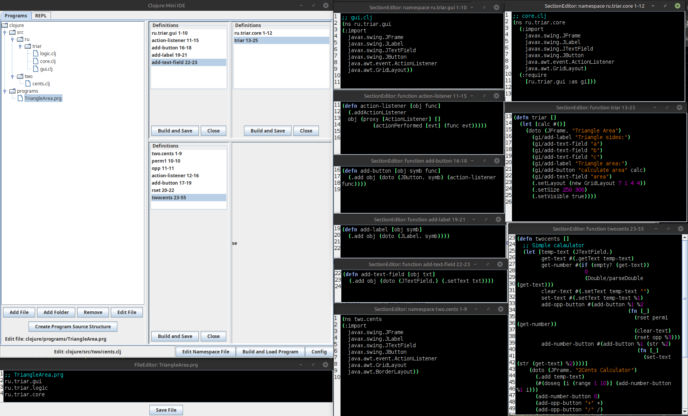

# ClojureMiniIDE
A minimalistic integrated development environment for the Clojure programming language.



## Special Features

1. **Program.** 
In Clojure, there's no concept of a "program"; there's only the concept of a "namespace". 
These aren't quite the same thing. A given task typically requires multiple namespaces. 
ClojureMiniIDE defines a *program* as an ordered sequence of namespaces. 
The order is determined by the order in which namespaces must be loaded, 
as this is essential for program operation. 
A special button is available for automatically loading a program.

2. **Separate windows for functions and other program elements.** 
This allows you to simultaneously edit multiple functions on the screen, from different namespaces, 
and only those needed at the moment. The automatic loading button simultaneously 
composes ("builds") various namespaces from all open and possibly modified elements, 
saves them, and loads them in the desired order.

## Usage

### Variant 1 

#### Needs only clojure directory in a root folder

```shell
$ cd <some root folder>
$ java -jar ClojureMiniIDE-0.1.0.jar # Linux, MacOS, Windows
```

### Variant 2

#### Needs clojure directory and lib directory with it's content in a root folder

```shell
$ cd <some root folder>
$ ./run.sh       # Linux, MacOS
$ run.bat        # Windows
```
## Video Lessons

### Lesson 1. Load namespace file and evaluate function from it

[](https://www.youtube.com/watch?v=rsOQ28tGRRY)

## License

Copyright © 2025 Ruslan Sorokin

Distributed under the Eclipse Public License either version 1.0 or (at
your option) any later version.
